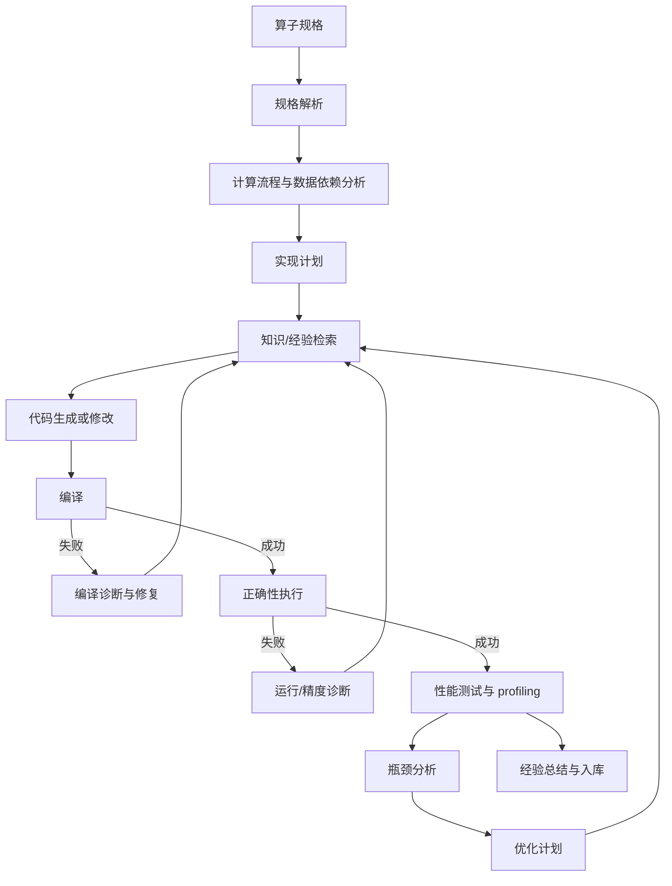

# 算子编程 Agent 工作流

## 总览

Agent 的核心循环是：理解规格、制定计划、检索知识、生成代码、编译执行、性能分析、修复优化、沉淀经验。

## 阶段定义

### 1. 规格解析

输入：

- 算子名称和数学定义。
- 输入输出 tensor 的 shape、dtype、layout。
- broadcasting、边界条件、精度要求。
- 性能目标和目标硬件。

输出：

- 结构化规格。
- 测试样例需求。
- 风险点列表。

### 2. 计算流程分析

关注：

- 数据依赖和访存模式。
- 可并行维度。
- reduction、broadcast、transpose 等特殊模式。
- 中间结果是否需要缓存。

输出：

- 计算分解。
- tiling 候选。
- 数据搬运策略候选。

### 3. Planning

计划应包含：

- 实现路线。
- 需要检索的知识。
- 代码文件修改点。
- 测试策略。
- 性能指标和停止条件。

### 4. Coding

要求：

- 优先复用工程模板和样例。
- 记录关键实现假设。
- 生成代码后立即进入编译验证。

### 5. 编译诊断

Agent 应提取：

- 第一处关键错误。
- 错误类型：API、类型、shape、内存、语法、构建配置、版本兼容。
- 相关代码位置。
- 检索 query。
- 修复动作和结果。

### 6. 正确性执行

检查：

- 是否运行成功。
- 输出 shape/dtype 是否正确。
- 与参考实现误差是否满足阈值。
- 边界 case 是否覆盖。

### 7. 性能测试与分析

采集：

- latency/throughput。
- kernel 时间。
- 数据搬运开销。
- AI Core 利用率。
- 带宽、访存热点、同步开销。

分析：

- 是计算瓶颈还是访存瓶颈。
- tiling 是否合理。
- 是否存在不必要的中间搬运。
- 并行粒度是否过细或过粗。

### 8. 经验入库

每轮任务结束时保存：

- 原始规格。
- 最终代码摘要或 diff。
- 失败尝试。
- 有效修复。
- 性能变化。
- 可复用结论。
- 适用边界。

## 停止条件

- 正确性通过且性能达到目标。
- 多轮优化收益低于阈值。
- 关键错误无法通过现有知识解决，需要人工介入。
- 达到预算限制：轮数、时间、编译次数或运行次数。

